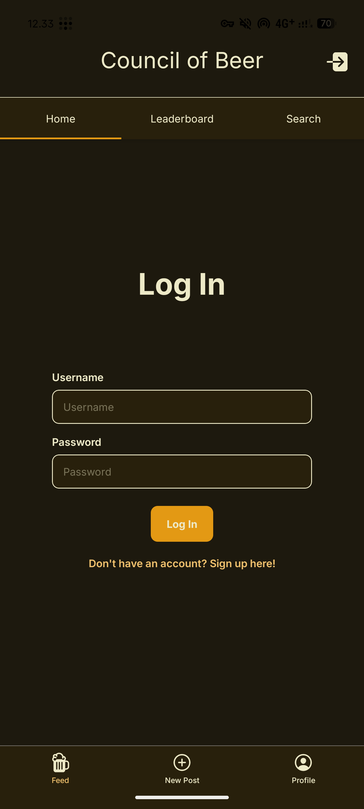
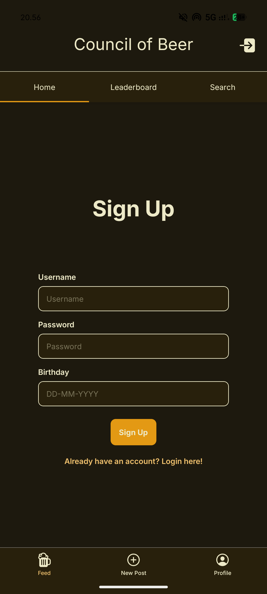
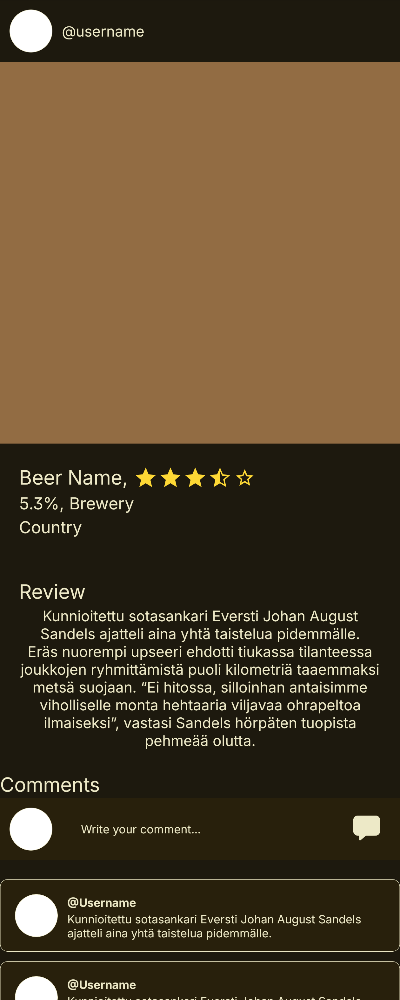
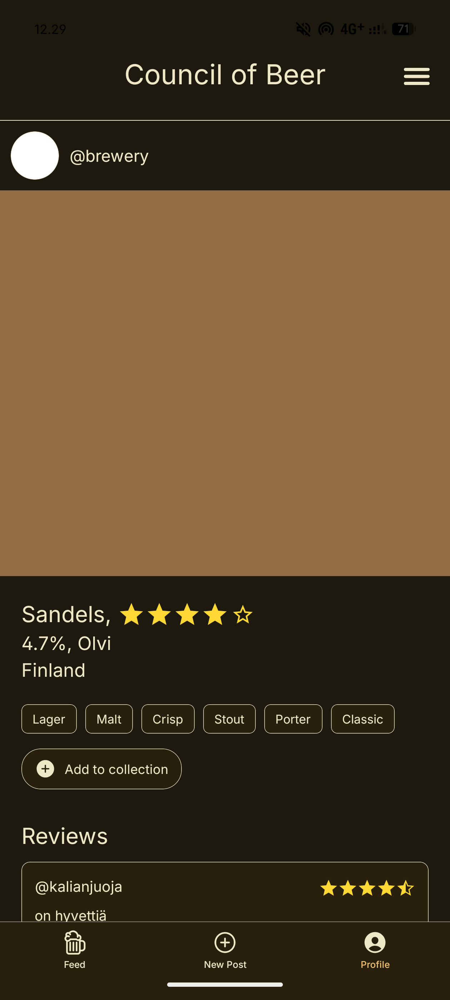

# Council-Of-Beer

Council of Beer is a social media app for sharing and discovering beers. The app is aimed towards people over the age of 18 that are interested in beer, especially students. This project was done in collaboration between finnish and dutch students in a short-term exchange.

### The app

### Technical information

Front-end of the app is developed with React Native/Expo, back-end is developed in C# with a PostgreSQL database. The app uses fetch to connect backend and frontend. 

Documentation for endpoints and the project requirements can be found here:

[Endpoint documentation](https://docs.google.com/document/d/1gM8-We3tKFnQQ7tYDEpT5TZS4sAdaB8miwwqCoh5_T0/edit?usp=sharing)

### Installation

You can get your own development version of the app by copying the repo and deploying it in expo. 

